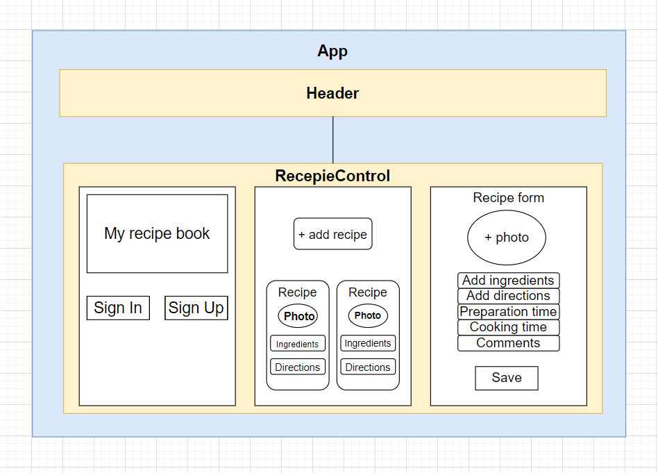

# My recipe book

## Capstone project

#### By: Viktoria Zubarieva

#### Description

website url https://my-recipe-book-e2c62.web.app/

## Technologies Used

- React
- JavaScript
- TypeScript
-

## Setup/Installation Requirements

- _Clone repository from GitHub_
- _Open your terminal and run the command $ git clone https://github.com/vzubarieva/My-recipe-book-capstone_
- Navigate to
- Open in code editor (VS Code)
- Install dependencies: $ npm install
- Run Program $ npm run start ( It should open the server http://localhost:3000/ )
-

## Known Bugs

-

## License

_MIT_

Copyright (c) _2022_ _Viktoriia Zubarieva_

## Research and planning Log

#### Friday, 11/04

- 2:40 pm - 5.00 pm - Brainstorming and plan my research
- 5:30 pm - 6.00 pm - watched video "How to Connect Firebase With React Application"
- 6:00 pm - 6.30 pm - created an account at firebase.google.com and create react app
- 6.30 pm - 7.15 pm - set up firebase connection and deployment

#### Sunday, 11/06

- 5:00 pm - 5:15 pm - watched video "TypeScript - The Basics"

#### Monday, 11/14

-7:00 - 9:00 pm - watched video tutorial Material UI

#### Tuesday, 11/15

-7:30 - 9:00 pm - continue watching Material Ui tutorial
